# 🛒 HuyShop — Microservice E-Commerce Platform

<p align="center">
  
  
  
  
  
  
  
</p>

> Hệ thống thương mại điện tử được xây dựng theo kiến trúc **Microservices**, giao tiếp nội bộ qua **gRPC**, phơi API ra bên ngoài thông qua một **API Gateway** duy nhất.

---

## 📁 Cấu trúc Repository

```
huyshop/
├── api/               # 🚪 API Gateway — điểm vào duy nhất cho mọi request
├── user/              # 👤 User Service — quản lý người dùng, xác thực, đơn hàng
├── product/           # 📦 Product Service — sản phẩm, danh mục, đánh giá, đơn hàng
├── voucher/           # 🎟️  Voucher Service — mã giảm giá, quản lý voucher
├── permission/        # 🔐 Permission Service — phân quyền RBAC, role & page
├── cron/              # ⏰ Cron Service — lập lịch tác vụ tự động (HTTP caller)
├── header/            # 📋 Proto Headers — định nghĩa gRPC contract dùng chung
├── new-admin/         # 🖥️  Admin Panel — giao diện quản trị (React + Vite)
├── customer/          # 🌐 Customer App — giao diện khách hàng (Next.js)
├── infrastructure/    # 🐳 Infrastructure — Docker Compose cho toàn bộ hệ thống
└── screenshots/       # 🖼️  Screenshots — ảnh minh họa giao diện hệ thống
```

---

## 🏗️ Kiến trúc hệ thống

```
                        ┌─────────────────────────────────────────┐
                        │              CLIENT LAYER                │
                        │   new-admin (Vite/React)                 │
                        │   customer  (Next.js)                    │
                        └──────────────┬──────────────────────────┘
                                       │ HTTP/REST
                                       ▼
                        ┌─────────────────────────────────────────┐
                        │            API GATEWAY  :8080           │
                        │   - JWT Authentication & Authorization  │
                        │   - Request Routing                     │
                        │   - File Upload (Cloudinary)            │
                        │   - Redis Caching                       │
                        └──┬──────────┬──────────┬───────────┬───┘
                           │ gRPC     │ gRPC      │ gRPC      │ gRPC
                           ▼          ▼           ▼           ▼
                    ┌──────────┐ ┌─────────┐ ┌────────┐ ┌──────────┐
                    │  User    │ │ Product │ │Voucher │ │Permission│
                    │  :6000   │ │  :8000  │ │  :4000 │ │  :7000   │
                    └────┬─────┘ └────┬────┘ └───┬────┘ └────┬─────┘
                         │             │           │           │
                         └─────────────┴───────────┴──────────┘
                                               │
                             ┌─────────────────┴──────────────┐
                             │         INFRASTRUCTURE          │
                             │   MySQL :3307  │  Redis :6380   │
                             └─────────────────────────────────┘
                                               │
                                  ┌────────────┘
                                  ▼
                           ┌─────────────┐
                           │    Cron     │
                           │  (Scheduler)│
                           └─────────────┘
```

---

## 🔧 Các Service chi tiết

### 🚪 API Gateway (`/api`) — Port `8080`

**Ngôn ngữ:** Go  
**Vai trò:** Cổng vào duy nhất của hệ thống. Nhận toàn bộ request HTTP từ client, xác thực JWT, kiểm tra quyền, rồi forward xuống các backend service qua gRPC.

| Tính năng | Mô tả |
|---|---|
| REST → gRPC | Proxy request từ HTTP sang gRPC tới các service |
| JWT Auth | Xác thực token, giải mã payload người dùng |
| RBAC | Kiểm tra quyền truy cập qua Permission Service |
| Redis Cache | Cache dữ liệu thường xuyên truy vấn |
| File Upload | Upload ảnh qua Cloudinary |
| Admin/Customer Router | Routing riêng cho admin và khách hàng |

**Kết nối gRPC:**
- `USER_GRPC_SERVER` → User Service `:6000`
- `PRODUCT_GRPC_SERVER` → Product Service `:8000`
- `PERM_GRPC_SERVER` → Permission Service `:7000`
- `VOUCHER_GRPC_SERVER` → Voucher Service `:4000`

---

### 👤 User Service (`/user`) — Port `6000` (gRPC) / `6001` (HTTP)

**Ngôn ngữ:** Go  
**Database:** MySQL (`user` DB)

| Tính năng | Mô tả |
|---|---|
| Đăng ký / Đăng nhập | Tạo tài khoản, login bằng email + password |
| JWT Token | Phát hành Access Token & Refresh Token |
| Quản lý địa chỉ | Thêm/sửa/xóa địa chỉ giao hàng (tối đa 5) |
| Thanh toán VNPay | Tích hợp cổng thanh toán VNPay |
| Điểm thưởng | Hệ thống tích điểm và đổi điểm |
| Email (Brevo) | Gửi email xác nhận, thông báo đơn hàng |
| Quản lý đơn hàng | Xem lịch sử, trạng thái đơn hàng của user |
| Partner | Quản lý đối tác bán hàng |

---

### 📦 Product Service (`/product`) — Port `8000` (gRPC)

**Ngôn ngữ:** Go  
**Database:** MySQL (`product` DB) + Redis (cart cache)

| Tính năng | Mô tả |
|---|---|
| Sản phẩm | CRUD sản phẩm, tìm kiếm, lọc theo danh mục |
| Danh mục | Quản lý category phân cấp |
| Loại sản phẩm | Quản lý variants/product types |
| Giỏ hàng | Lưu cart trong Redis với TTL |
| Đơn hàng | Tạo, xử lý, cập nhật trạng thái đơn hàng |
| Đánh giá | Review sản phẩm từ khách hàng |
| Banner | Quản lý banner quảng cáo |
| Báo cáo | Thống kê doanh thu, tồn kho |
| VNPay | Xử lý callback thanh toán |

---

### 🎟️ Voucher Service (`/voucher`) — Port `4000` (gRPC)

**Ngôn ngữ:** Go  
**Database:** MySQL (`voucher` DB) + Redis

| Tính năng | Mô tả |
|---|---|
| Tạo voucher | Tạo mã giảm giá theo loại (%, cố định) |
| Áp dụng voucher | Kiểm tra hợp lệ, tính toán giảm giá |
| Voucher người dùng | Gán voucher cho user cụ thể |
| Mã code | Generate và quản lý mã code ngắn gọn |

---

### 🔐 Permission Service (`/permission`) — Port `7000` (gRPC)

**Ngôn ngữ:** Go  
**Database:** MySQL (`permission` DB) + Redis

| Tính năng | Mô tả |
|---|---|
| Role (Vai trò) | CRUD vai trò, gán nhóm quyền |
| Page (Trang) | Quản lý trang/menu theo phân quyền |
| RBAC | Kiểm tra quyền `role → group → action` |
| Menu động | Trả về menu phù hợp theo vai trò đăng nhập |

---

### ⏰ Cron Service (`/cron`)

**Ngôn ngữ:** Go  
**Database:** MySQL

| Tính năng | Mô tả |
|---|---|
| Lập lịch HTTP | Gọi HTTP GET/POST theo cron expression |
| Quản lý job | CRUD cấu hình cron job động (không cần restart) |
| Múi giờ | Hỗ trợ timezone cho từng job |
| Ghi log | Lưu lịch sử thực thi mỗi lần chạy |
| Hot reload | Tự động reload khi có thay đổi cấu hình |

---

### 📋 Proto Headers (`/header`)

Thư viện chứa toàn bộ **Protobuf definitions** (`.proto`) dùng chung giữa các service:

| File | Service |
|---|---|
| `user.proto` | Định nghĩa UserService gRPC contract |
| `product.proto` | Định nghĩa ProductService gRPC contract |
| `permission.proto` | Định nghĩa PermissionService gRPC contract |
| `voucher.proto` | Định nghĩa VoucherService gRPC contract |
| `common.proto` | Các message dùng chung (Empty, Error...) |

---

## 🖼️ Screenshots

### 🌐 Giao diện Khách hàng (Customer App)

**Trang chủ**
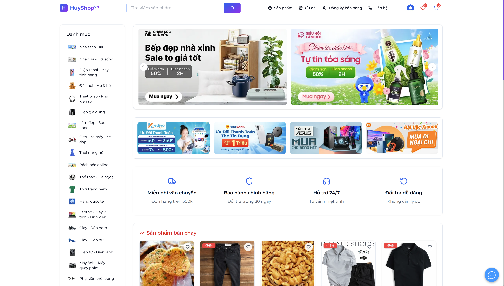

**Tìm kiếm sản phẩm**
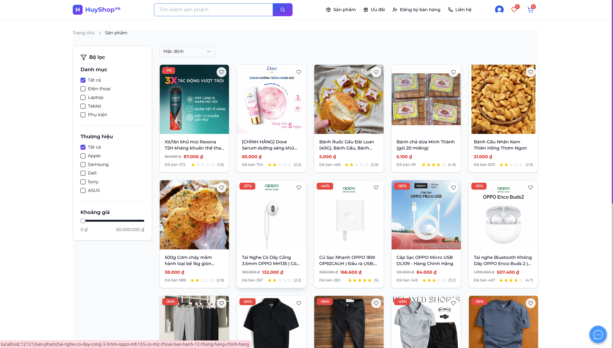

**Chi tiết sản phẩm**
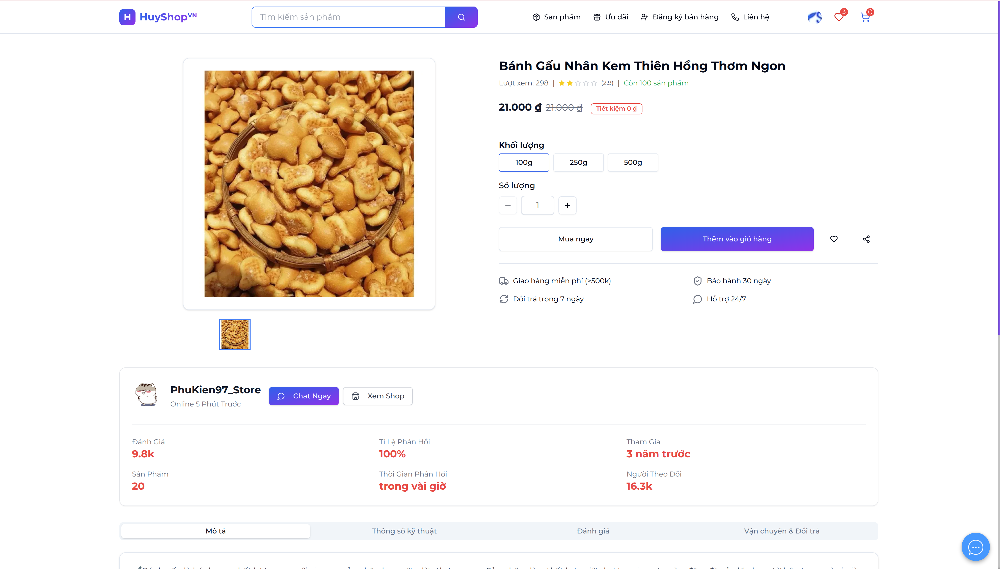

**Giỏ hàng**
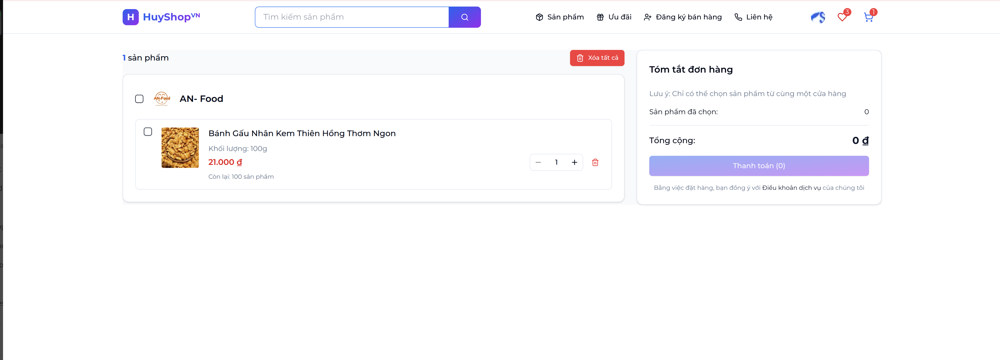

**Đơn hàng**
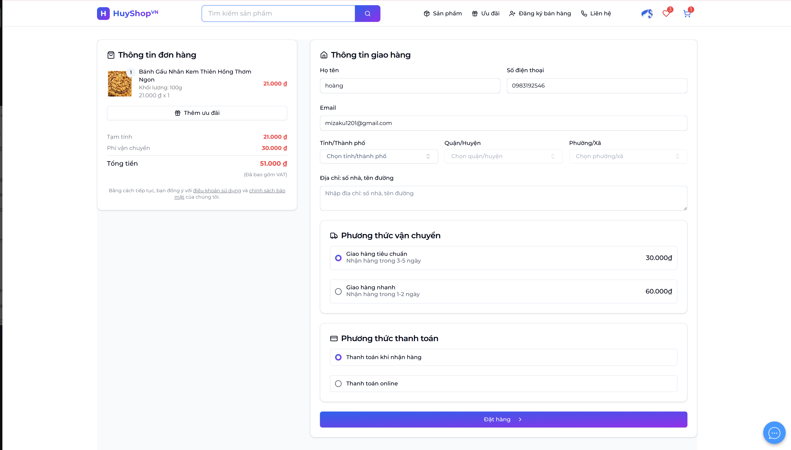

**Yêu thích**
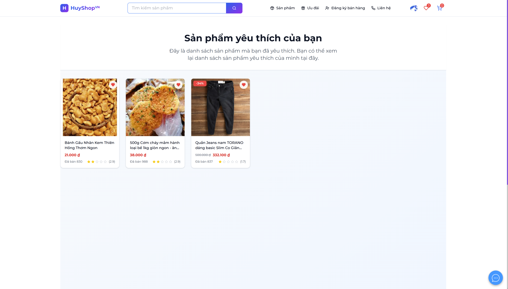

**Gói dịch vụ / Plan**
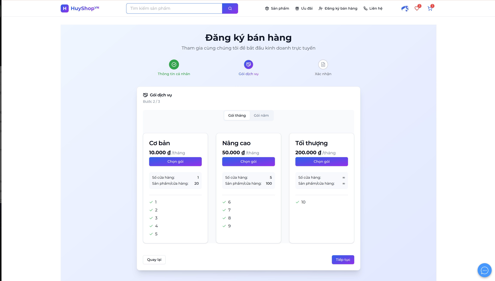

---

### 🖥️ Giao diện Quản trị (Admin Panel)

**Đăng nhập Admin**
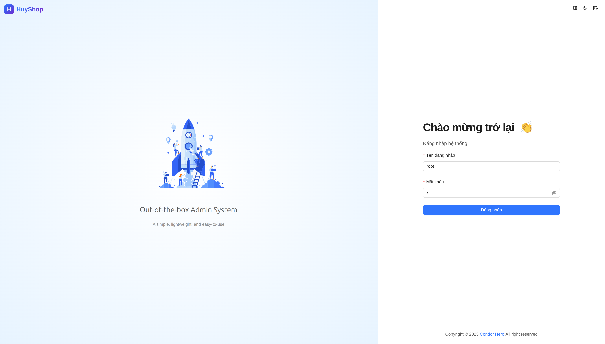

**Quản lý sản phẩm**
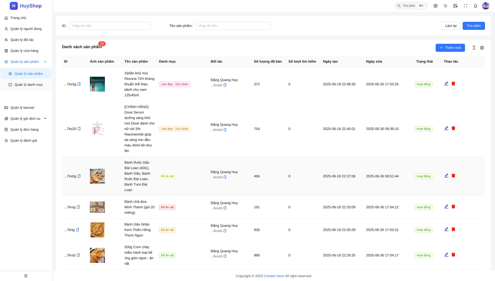

**Quản lý danh mục**
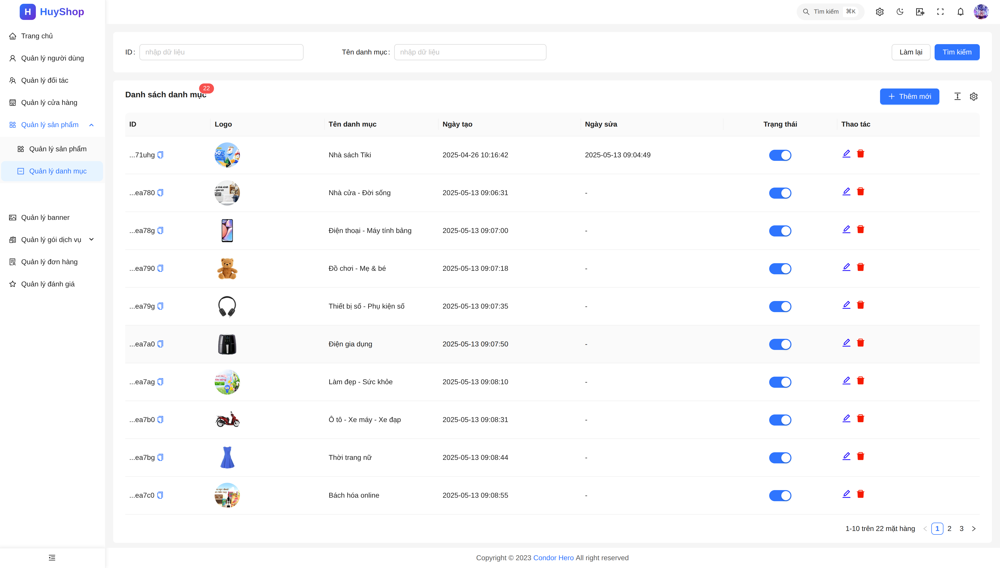

**Quản lý người dùng**
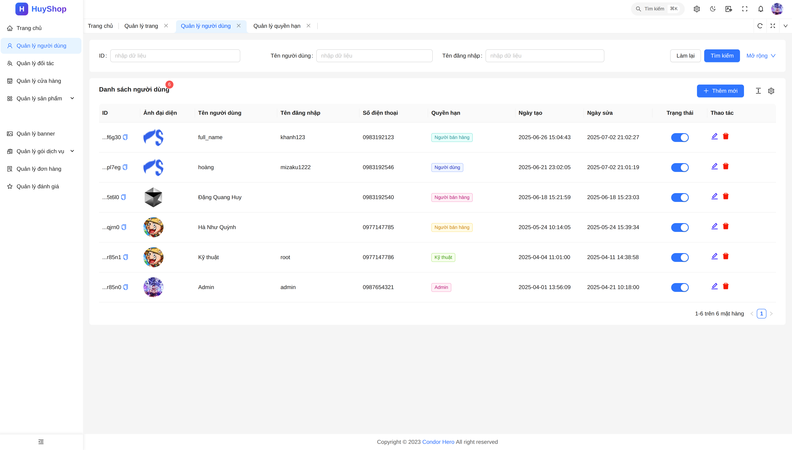

**Quản lý banner**
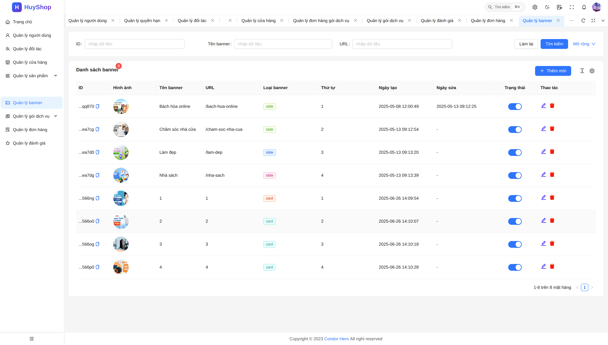

**Quản lý gói / Plan**
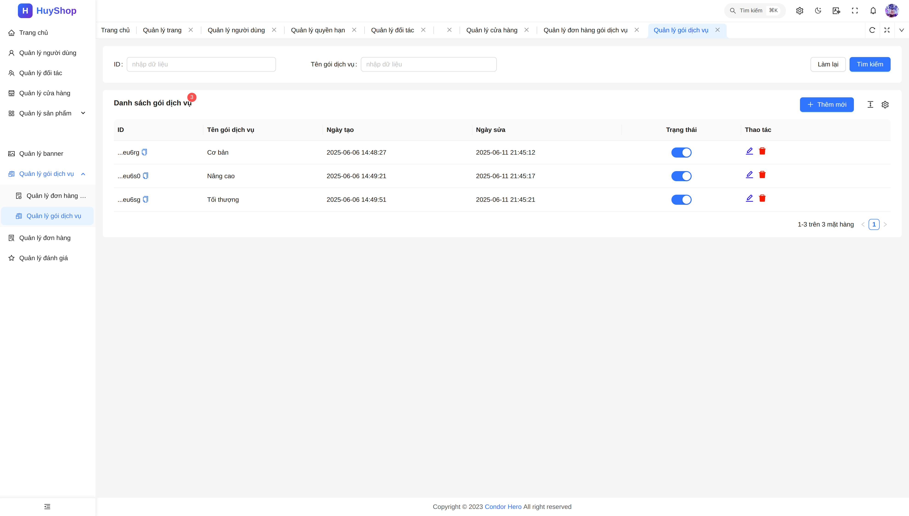

---

### 🤝 Giao diện Đối tác (Partner)

**Quản lý cửa hàng**
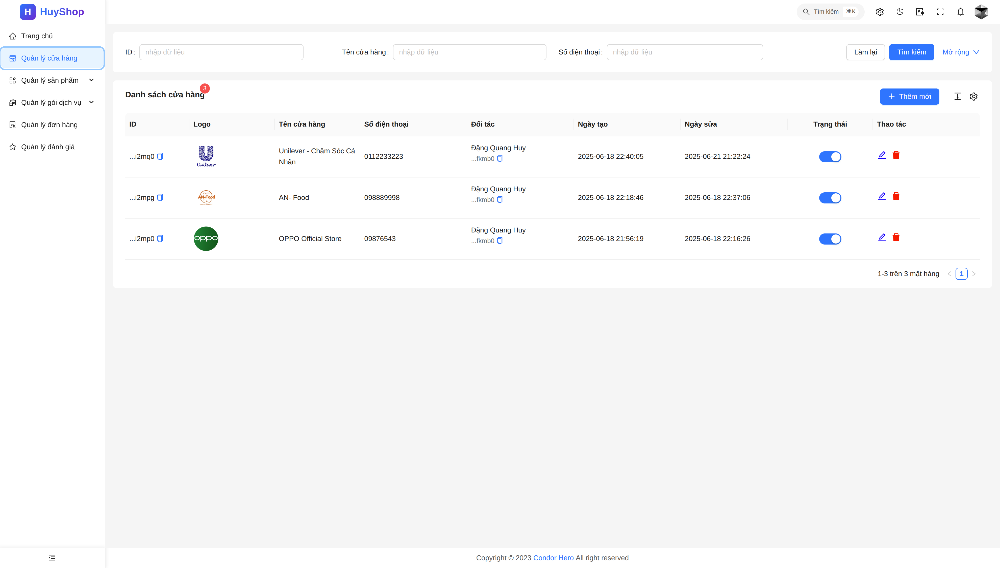

**Đơn hàng đối tác**
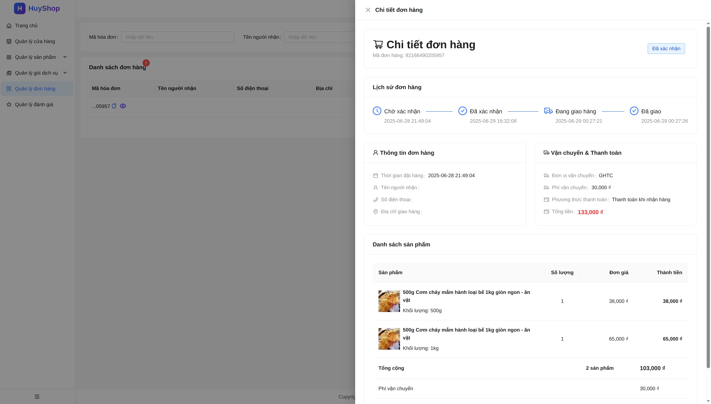

---

### 🔐 Kỹ thuật — Phân quyền RBAC

**Cấu hình phân quyền**
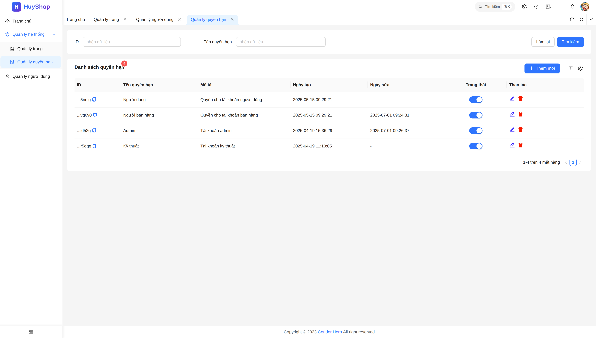

**Chi tiết phân quyền**
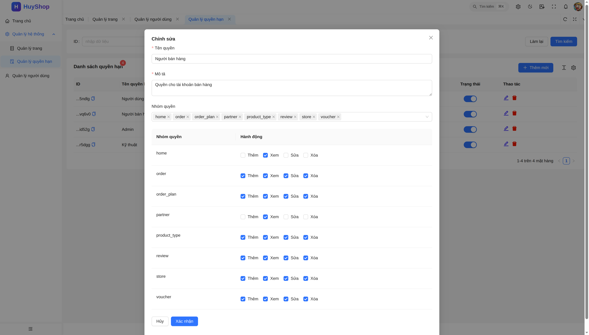

**Tạo trang / Page management**
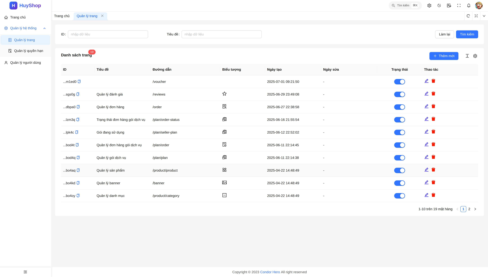

---

## 🚀 Khởi động hệ thống

### Yêu cầu

- [Docker](https://docs.docker.com/get-docker/) & [Docker Compose](https://docs.docker.com/compose/)
- Go `1.21+` (nếu chạy service thủ công)
- Node.js `18+` & Yarn (nếu chạy frontend thủ công)

### Chạy toàn bộ hệ thống bằng Docker Compose

```bash
cd infrastructure
docker compose up -d --build
```

Sau khi khởi động, các service sẽ có mặt tại:

| Service | URL / Port |
|---|---|
| API Gateway | `http://localhost:8080` |
| User Service (gRPC) | `localhost:6000` |
| Product Service (gRPC) | `localhost:8000` |
| Permission Service (gRPC) | `localhost:7000` |
| Voucher Service (gRPC) | `localhost:4000` |
| MySQL | `localhost:3307` |
| Redis | `localhost:6380` |

### Chạy từng service riêng lẻ (Development)

Mỗi service Go có `Makefile` với các lệnh tiêu chuẩn:

```bash
cd <service-name>

# Build binary
make build

# Chạy trực tiếp
make run

# Build Docker image
make docker-build
```

> Sao chép `.env.example` thành `.env` và điền giá trị trước khi chạy.

---

## ⚙️ Biến môi trường quan trọng

### API Gateway

| Biến | Mô tả | Default |
|---|---|---|
| `PORT` | Port lắng nghe HTTP | `8080` |
| `USER_GRPC_SERVER` | Địa chỉ User Service | `localhost:6000` |
| `PRODUCT_GRPC_SERVER` | Địa chỉ Product Service | `localhost:8000` |
| `PERM_GRPC_SERVER` | Địa chỉ Permission Service | `localhost:7000` |
| `VOUCHER_GRPC_SERVER` | Địa chỉ Voucher Service | `localhost:4000` |
| `JWT_SECRET_KEY` | Khóa bí mật JWT | *(bắt buộc)* |
| `REDIS_ADDR` | Địa chỉ Redis | `localhost:6379` |
| `CLOUDINARY_NAME` | Cloudinary cloud name | *(bắt buộc)* |
| `ADMIN_ROLE` | ID của role Admin | *(bắt buộc)* |

### User Service

| Biến | Mô tả |
|---|---|
| `GRPC_PORT` | Port gRPC (default: `6000`) |
| `DB_PATH` | MySQL connection string |
| `DB_NAME` | Tên database (`user`) |
| `JWT_SECRET_KEY` | Khóa JWT (phải khớp với API Gateway) |
| `JWT_EXPIRE_ACCESS_TOKEN` | TTL access token (phút) |
| `JWT_EXPIRE_REFRESH_TOKEN` | TTL refresh token (phút) |
| `BREVO_API_KEY` | API key gửi email qua Brevo |
| `VNP_HASH_SECRET` | Secret hash VNPay |
| `VNP_TMNCODE` | Merchant code VNPay |
| `REDIS_ADDR` | Địa chỉ Redis |

---

## 🔄 Luồng giao tiếp gRPC

Tất cả giao tiếp nội bộ giữa các service sử dụng **gRPC + Protobuf**. Contract được định nghĩa trong thư mục `/header` và compile thành Go code trước khi sử dụng:

```bash
cd header
make gen   # Tạo Go code từ .proto files
```

---

## 🗄️ Database

Hệ thống sử dụng **MySQL 8.0** với mỗi service có database riêng (Database-per-Service pattern):

| Service | Database |
|---|---|
| User Service | `user` |
| Product Service | `product` |
| Permission Service | `permission` |
| Voucher Service | `voucher` |
| Cron Service | *(MySQL riêng)* |

**Redis** được dùng cho:
- Session cache & JWT blacklist
- Giỏ hàng (Cart) với TTL
- Cache dữ liệu sản phẩm, permission
- Hàng đợi xử lý đơn hàng

---

## 🛠️ Tech Stack

| Thành phần | Công nghệ |
|---|---|
| Backend Services | Go (Golang) |
| Giao tiếp nội bộ | gRPC + Protocol Buffers |
| API Gateway | Go |
| Admin Frontend | React + Vite + TypeScript + TailwindCSS |
| Customer Frontend | Next.js 14 + TypeScript + TailwindCSS |
| Database | MySQL 8.0 |
| Cache / Queue | Redis (Alpine) |
| Container | Docker + Docker Compose |
| File Storage | Cloudinary |
| Email | Brevo (Sendinblue) |
| Thanh toán | VNPay |

---

## 📝 Ghi chú phát triển

- Mỗi service trong repo này từng là một repository độc lập và giờ được hợp nhất vào monorepo để dễ quản lý.
- Khi thêm API mới, cập nhật `.proto` trong `/header` → chạy `make gen` → cập nhật implementation trong service tương ứng.
- Không commit `.env` thật lên git. Luôn dùng `.env.example` làm template.
- Các biến `VNP_*` và `JWT_SECRET_KEY` phải nhất quán giữa các service.

---

<p align="center">Made with ❤️ — HuyShop Platform</p>
